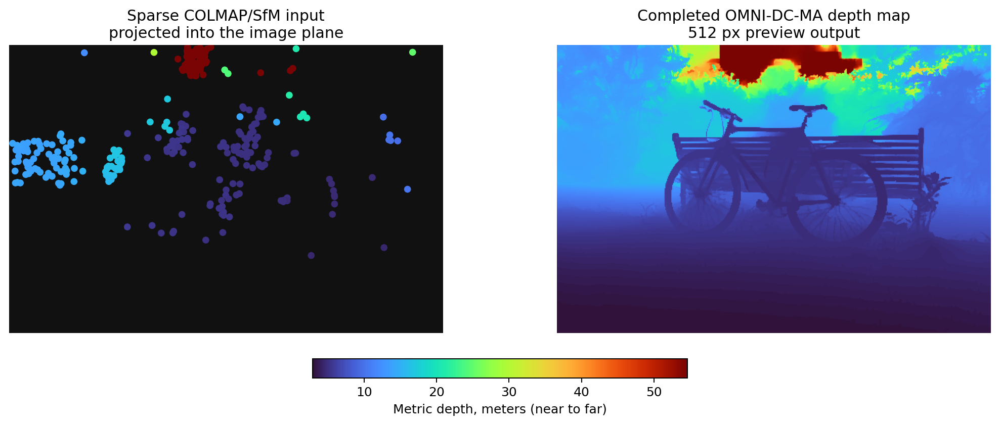

<!-- SPDX-License-Identifier: AGPL-3.0-only -->

# OMNI-DC-MA

This is the organized inference-focused build of the current OMNI-DC MA-depthmap pipeline. It keeps the runtime path, TensorRT export hooks, bicycle smoke tests, and COLMAP sparse-depth tooling, while leaving out the training datasets, losses, metrics, experiment folders, and generated outputs from the source workspace.

<p align="center">
  
</p>

<p align="center"><em>Example bicycle frame: sparse metric SfM anchors projected to 2D as the input depth signal, compared with the completed 512 px OMNI-DC-MA depth map.</em></p>

## What Is Included

- `run_demo.py`: repo-root launcher for single-image and directory inference.
- `src/demo.py`: batching, 512-preview resizing, CUDA graph capture, output writing, and optional profiling.
- `src/model/`: OGNIDC, MA-depthmap prior, optimized CG layer, TensorRT hooks, and final-output representative interpolation.
- `tools/`: benchmark, profiling, TensorRT export, DCN build, and sparse-depth generation utilities.
- `tests/`: import smoke tests plus an optional local bicycle regression test.
- `docs/`: short design and optimization notes for the current inference path.

Weights, TensorRT engines, datasets, predictions, and visualizations are intentionally ignored by git.

## Setup

```powershell
cd C:\Users\opsiclear\Desktop\projects\OMNI-DC-MA
uv sync --extra trt
```

If `src/model/deformconv/DCN*.pyd` is missing or incompatible with the local Python/Torch/CUDA stack, rebuild it:

```powershell
tools\build_dcn.cmd
```

The OMNI-DC weights are loaded through `OGNIDC.from_pretrained("zuoym15/OMNI-DC")` at runtime. Local checkpoints and TensorRT engines belong under `checkpoints/`, which is ignored.

## Release Assets

Pinned model artifacts are published as GitHub release assets instead of being committed to git:

- `omnidc_v1.1.safetensors`: OMNI-DC model weights.
- `metricanything_student_depthmap.pt`: MA-depthmap prior weights.
- `DCN.cp312-win_amd64.pyd`: optional prebuilt Windows/Python 3.12/Torch 2.11 CUDA extension.
- `SHA256SUMS.txt`: integrity checksums.

```powershell
gh release download v0.1.0 -R OpsiClear-3DV/OMNI-DC-MA --dir release_assets
```

## Best Current Path

For whole-scene processing on the bicycle-style COLMAP dataset, the current best throughput path is batch 16 at `--demo_max_size 512` with TensorRT, fixed-iteration capturable CG, CUDA graph replay, and the final-output representative interpolation path:

```powershell
uv run python run_demo.py --gpus 0 --demo_rgb_dir C:\Users\opsiclear\Desktop\Data_WS1\360_v2\bicycle\images_2 --demo_depth_dir C:\Users\opsiclear\Desktop\Data_WS1\360_v2\bicycle\omnidc_test\sparse_depth_all_images_2 --demo_out_dir C:\Users\opsiclear\Desktop\Data_WS1\360_v2\bicycle\omnidc_test\pred_current_all_images_512 --demo_batch_size 16 --demo_max_size 512 --demo_outputs depth,vis --trt --capturable_inference --cg_fixed_iters 120 --demo_cuda_graph --anchor_cap_factor 2
```

Use full resolution and batch 1 when the priority is maximum per-image fidelity rather than scene throughput:

```powershell
uv run python run_demo.py --gpus 0 --demo_rgb <image.jpg> --demo_depth <sparse_depth.npy> --demo_out_dir outputs\single --demo_outputs depth,raw,vis --trt --anchor_cap_factor 2
```

## Generate COLMAP Sparse Depth

Convert a COLMAP sparse model into OMNI-DC sparse depth `.npy` files:

```powershell
uv run python tools\generate_colmap_sparse_depth.py --model-dir C:\Users\opsiclear\Desktop\Data_WS1\360_v2\bicycle\sparse\0 --rgb-dir C:\Users\opsiclear\Desktop\Data_WS1\360_v2\bicycle\images_2 --out-dir C:\Users\opsiclear\Desktop\Data_WS1\360_v2\bicycle\omnidc_test\sparse_depth_all_images_2
```

The tool uses COLMAP camera poses and point tracks, writes one full-size `float32` depth map per matched RGB image, and uses `0` as the invalid-depth sentinel.

## Outputs

For each RGB stem, `run_demo.py` can write:

- `<stem>.npy`: capped dense depth in meters.
- `<stem>_raw.npy`: raw dense depth when it differs from the capped depth.
- `<stem>.png`: color visualization.
- `<image-name>.png`: optional sky/far-field mask when `skymask` is requested.

The anchor cap defaults to `2 * max(valid sparse depth)`, which removes unconstrained far-field extrapolation while keeping downstream consumers compatible with the sparse-depth `0 == invalid` convention.

## Licensing And Attribution

OMNI-DC-MA is a mixed-license repository, not a single-license AGPL relicensing of every file.

New OMNI-DC-MA content is licensed under AGPL-3.0-only; see `LICENSE` for the AGPL text. Upstream and vendored components retain their original licenses, copied under `LICENSES/` and mapped in `NOTICE.md`.

This repository includes code derived from Princeton `princeton-vl/OMNI-DC`, Metric-Anything, DINOv3, DCNv2, COLMAP utilities, and RAFT-adapted update blocks. This product is built with DINOv3.

## More Detail

- [Current design](docs/current-design.md)
- [Optimization notes](docs/optimization-notes.md)
- [Tools guide](tools/README.md)
