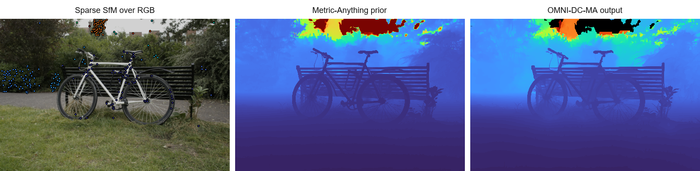

<!-- SPDX-License-Identifier: AGPL-3.0-only -->

# OMNI-DC-MA

OMNI-DC-MA turns RGB images plus sparse COLMAP/SfM metric depth anchors into dense metric depth maps. It is an inference-focused, organized OMNI-DC fork with a Metric-Anything depth prior, COLMAP-aware focal scaling, higher-certainty sparse-depth generation, batch processing, and optional TensorRT acceleration.

<p align="center">
  
</p>

<p align="center"><em>Example bicycle frame: sparse SfM anchors overlaid on RGB, COLMAP-intrinsics-scaled Metric-Anything prior, and OMNI-DC-MA completion with a 1.25x prior sky/far mask. Sparse points and valid depths use Turbo on a fixed 0-75 m scale; invalid pixels are black.</em></p>

## Why This Fork

- **Inference-first repo layout:** the runnable depth-completion path is separated from training and experiment clutter.
- **COLMAP/SfM workflow:** includes a sparse-depth generator for COLMAP models and automatically uses COLMAP camera intrinsics during MA metric-depth conversion.
- **Better sparse anchors:** default COLMAP filtering keeps longer tracks with lower reprojection error, with optional inverse-depth consistency filtering against a reference depth map.
- **Scene-scale processing:** supports basename-matched RGB/depth directories, 512 px preview batches, and full-resolution batch-1 output.
- **Optional speed path:** TensorRT, CUDA graph replay, fixed-iteration CG, and final-output representative interpolation are available for validated preview workloads.
- **Safer output convention:** sky/far-field regions can be written as `0`, matching the sparse-depth invalid-pixel convention.

## Requirements

- Python `3.12`
- CUDA-capable PyTorch environment; this repo is currently validated with Torch `2.11.0` + CUDA `13.0`
- `uv` for environment setup
- COLMAP sparse reconstruction if you want to generate sparse depth from SfM
- Optional: TensorRT `10.15+` for the accelerated preview path

Large weights, TensorRT engines, datasets, predictions, and generated visualizations are intentionally not git-tracked.

## Install

```powershell
git clone https://github.com/OpsiClear-3DV/OMNI-DC-MA.git
cd OMNI-DC-MA
uv sync
```

Install TensorRT/export dependencies only if you need them:

```powershell
uv sync --extra trt
```

If the prebuilt deformable-convolution extension does not match your machine, rebuild it:

```powershell
tools\build_dcn.cmd
```

## Expected Data Layout

A typical COLMAP scene should look like this:

```text
scene/
  images_2/
    _DSC8679.JPG
    ...
  sparse/
    0/
      cameras.bin
      images.bin
      points3D.bin
```

After sparse-depth generation, OMNI-DC-MA expects basename-matched inputs:

```text
scene/
  images_2/
    _DSC8679.JPG
  omnidc_test/
    sparse_depth_all_images_2_certain/
      _DSC8679.npy
```

Sparse depth `.npy` files are metric depth in meters. `0` means invalid/no sparse anchor.

## Quickstart

Generate sparse depth maps from a COLMAP model:

```powershell
uv run python tools\generate_colmap_sparse_depth.py `
  --model-dir C:\path\to\scene\sparse\0 `
  --rgb-dir C:\path\to\scene\images_2 `
  --out-dir C:\path\to\scene\omnidc_test\sparse_depth_all_images_2_certain
```

Run one image:

```powershell
uv run python run_demo.py `
  --gpus 0 `
  --load_dav2 1 --num_resolution 3 `
  --multi_resolution_learnable_gradients_weights uniform `
  --GRU_iters 1 --optim_layer_input_clamp 1.0 `
  --depth_activation_format exp --whiten_sparse_depths 1 `
  --gru_internal_whiten_method median --backbone_mode rgbd `
  --pred_confidence_input 1 --max_depth 300.0 --data_normalize_median 1 `
  --demo_rgb C:\path\to\scene\images_2\_DSC8679.JPG `
  --demo_depth C:\path\to\scene\omnidc_test\sparse_depth_all_images_2_certain\_DSC8679.npy `
  --demo_out_dir C:\path\to\scene\omnidc_test\pred_single `
  --demo_outputs depth,raw,vis `
  --sky_mask --far_depth_factor 1.25 `
  --save_sky_mask --save_colmap_mask
```

Run a 512 px whole-scene preview:

```powershell
uv run python run_demo.py `
  --gpus 0 `
  --load_dav2 1 --num_resolution 3 `
  --multi_resolution_learnable_gradients_weights uniform `
  --GRU_iters 1 --optim_layer_input_clamp 1.0 `
  --depth_activation_format exp --whiten_sparse_depths 1 `
  --gru_internal_whiten_method median --backbone_mode rgbd `
  --pred_confidence_input 1 --max_depth 300.0 --data_normalize_median 1 `
  --demo_rgb_dir C:\path\to\scene\images_2 `
  --demo_depth_dir C:\path\to\scene\omnidc_test\sparse_depth_all_images_2_certain `
  --demo_out_dir C:\path\to\scene\omnidc_test\pred_512 `
  --demo_batch_size 16 --demo_max_size 512 `
  --demo_outputs depth,vis `
  --sky_mask --far_depth_factor 1.25 `
  --save_colmap_mask
```

For final per-image fidelity, prefer full resolution with batch size `1`. Use the 512 px path for fast scene sweeps and previews.

## COLMAP Intrinsics

By default, `run_demo.py` searches near the RGB/depth inputs for a COLMAP model directory such as `scene\sparse\0`. When found, it matches images by name/stem, scales the COLMAP focal length to the inference tensor width, and passes that focal length to the Metric-Anything prior.

Use an explicit model path when the automatic search is ambiguous:

```powershell
--demo_colmap_model_dir C:\path\to\scene\sparse\0
```

Use the legacy generic MA focal fallback only for debugging:

```powershell
--demo_colmap_model_dir none
```

## Sparse Point Filtering

The COLMAP converter defaults to more certain tracks:

- `--min-track-length 3`
- `--max-reproj-error 2`

To reject SfM anchors that disagree with an existing dense depth map, add a matched reference directory:

```powershell
uv run python tools\generate_colmap_sparse_depth.py `
  --model-dir C:\path\to\scene\sparse\0 `
  --rgb-dir C:\path\to\scene\images_2 `
  --out-dir C:\path\to\scene\omnidc_test\sparse_depth_consistent `
  --reference-depth-dir C:\path\to\scene\omnidc_test\pred_512 `
  --max-relative-inverse-depth-error 0.25 `
  --drop-inconsistent-points
```

Use `--max-inverse-depth-error` for an absolute inverse-depth threshold in `1/m`. Use `--align-reference-depth-scale` only when the reference maps are not already metric-aligned.

## Outputs

For each RGB stem:

- `<stem>.npy`: completed metric depth after output capping/masking.
- `<stem>_raw.npy`: raw dense depth, saved when it differs from the capped output.
- `<stem>.png`: color depth visualization.
- `<image-name>.png`: optional sky/far-field mask when `--sky_mask` is enabled and `--save_sky_mask` or `skymask` is requested.
- `scene/masks/<image-name>.png`: optional COLMAP-format mask when `--sky_mask` is enabled and `--save_colmap_mask` or `colmap_mask` is requested.

Sky/far masking is off by default. `--sky_mask` enables the MA prior sky/far mask; `-sky_mask` is accepted as a shorthand alias. `--far_depth_factor` controls the prior far-field mask and final output cap relative to the deepest sparse anchor. For example, `1.25` masks prior depths beyond `1.25 * max(valid sparse depth)`. The older `--anchor_cap_factor` name still works as an alias.

When `--sky_mask` is enabled, the sky/far mask is applied to the saved completed depth by default. Use `--no_apply_sky_mask` when you want to export masks but keep completed depth unzeroed. Invalid output pixels are `0`.

The `colmap_mask` output is compatible with COLMAP `ImageReader.mask_path`: white pixels are kept and black pixels are ignored. For an image such as `scene/images/frame.jpg`, the default export path is `scene/masks/frame.jpg.png`. Use `--demo_colmap_mask_dir C:\path\to\masks` to override the mask root. If inference runs at preview resolution, the mask is resized back to the original RGB image size with nearest-neighbor sampling.

## Model Assets

The model loads OMNI-DC weights from HuggingFace by default. Pinned release assets are also available:

```powershell
gh release download v0.1.0 -R OpsiClear-3DV/OMNI-DC-MA --dir release_assets
```

TensorRT engines are not shipped because they depend on GPU, CUDA, TensorRT, driver, and input shapes. Build them locally when needed:

```powershell
powershell -ExecutionPolicy Bypass -File tools\build_trt_engines.ps1
```

See [tools/README.md](tools/README.md) for TensorRT and DCN build details.

## Performance

The validated 512 px preview path can process batch-16 bicycle frames at roughly `0.055-0.056 s/image` on the measured RTX 5090 setup, about `24x` faster per image than the unmodified single-image OMNI-DC+MA path at the same preview size. That number is a preview-throughput benchmark, not a ground-truth accuracy claim.

See [docs/optimization-notes.md](docs/optimization-notes.md) for benchmark setup, error-vs-teacher numbers, and the TensorRT/CUDA graph details.

## Limitations

- Output quality depends on sparse-anchor quality and COLMAP scale.
- Sky/far-field masking is based on MA metric depth relative to sparse anchors; it is not semantic sky segmentation. It is off unless `--sky_mask` is passed.
- `--demo_max_size 512` is a preview path and can soften fine details.
- TensorRT engines are machine- and shape-specific.
- Full-resolution batch-1 is the preferred setting for final outputs.

## Repository Map

| Path | Purpose |
| --- | --- |
| `run_demo.py` | Repo-root inference launcher. |
| `src/demo.py` | Pair resolution, batching, resizing, CUDA graph handling, output writing. |
| `src/model/` | OGNIDC model, MA prior wrapper, optimization layer, TensorRT hooks. |
| `src/colmap_utils/` | Reusable COLMAP IO, filtering, sparse-depth, and point-editing helpers. |
| `tools/generate_colmap_sparse_depth.py` | COLMAP-to-sparse-depth converter. |
| `tools/add_colmap_depth_points.py` | Depth-guided utility for adding sparse COLMAP points in underfilled image cells. |
| `tools/build_trt_engines.ps1` | Local TensorRT engine build wrapper. |
| `docs/` | Design notes, optimization notes, release notes, README assets. |
| `tests/` | Import, tool, and optional local regression tests. |

## Verification

```powershell
uv run ruff check run_demo.py src\demo.py src\config.py src\model\infer.py src\model\colmap_intrinsics.py src\model\final_reps.py src\colmap_utils tools tests
uv run pytest tests\test_imports.py tests\test_colmap_intrinsics.py tests\test_colmap_mask_output.py tests\test_colmap_sparse_depth_tool.py tests\test_colmap_utils_editing.py tests\test_colmap_utils_densify.py
```

The bicycle end-to-end regression is optional and gated on local CUDA, weights, and the local bicycle dataset path.

## Documentation

- [Current design](docs/current-design.md)
- [Optimization notes](docs/optimization-notes.md)
- [Tools guide](tools/README.md)
- [v0.1.0 release notes](docs/release-v0.1.0.md)

## License And Attribution

OMNI-DC-MA is a mixed-license repository. New OMNI-DC-MA content is licensed under AGPL-3.0-only; upstream and vendored components retain their original licenses.

See [NOTICE.md](NOTICE.md) and [LICENSES/](LICENSES/) for the attribution and license map. This repository includes code derived from or vendored from Princeton `princeton-vl/OMNI-DC`, Metric-Anything, DINOv3, DCNv2, COLMAP utilities, and RAFT-adapted update blocks. This product is built with DINOv3.
